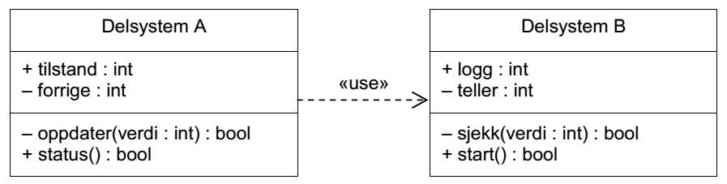

LF: C-programmering
===============
*Teoriøving i TTK4235 Tilpassede datasystemer*


1: Verktøykjeden
----------------

 1. *Fra Eksamen 2012, Oppgave 5c*:
   - Se også LF fra eksamen
   - Trinnene:
     - .c-fil
     - preprosessor
     - kompilator
     - assembler
     - .o-fil
     - lenker
     - kjørbart program
     - (lasting og kjøring)
   - Kompilering gjøres én gang per .c-fil (genererer én .o-fil for hver .c-fil). Lenking gjøres samlet for alle .o-filene.


2: Filer og Moduler
-------------------

 1. Hva er forskjellen mellom deklarasjoner og definisjoner?
   - Deklarasjon:
     - Det kompilatoren trenger for å forstå et navn ("identifier")
     - For type-sjekking
     - (Ved manglende deklarasjon av funksjoner vil kompilatoren forsøke å lage en implisitt deklasjon av typen `int()`)
     - Kan eksistere så mange ganger som man vil (så lenge de ser like ut)
   - Definisjon:
     - Det som trengs av lenkeren
       - Kompilatoren generer symboler fra definisjoner
     - Kan kun eksistere én gang
     - Definisjoner er også deklarasjoner

 1. Er det noen fundamental forskjell mellom headerfiler (*.h) og c-filer?
   - Nei.
   - (C++ -spesifikt: Templates må være i #include-erte filer, fordi instansiering må ha hele templatet)
 
 1. Hva gjør `static`:
   - På en variabel inni en funksjon
     - Beholder verdien mellom invokasjoner av funksjonen
     - (Dvs ikke stack-allokert)
   - På en global variabel (dvs utenfor en funksjon) eller en funksjon
     - Symboler eksporteres ikke fra denne kompilerings-enheten ("denne .c-filen")
       - (Strengt tatt så er symbolene lokale for objektfilen, og lenkeren velger å se bort i fra disse når den lenker sammen)
     - Variabler/funksjoner kan ikke refereres til fra andre kompilerings-enheter
       - Omtrentlig analogt til `private` i språk som har modulbegrep

 1. *Fra Eksamen 2012, Oppgave 5b*:

Hvilke mekanismer i programmeringsspråket C er egnet til å implementere den modulasiseringen (oppdelingen), avhengigheten og synligheten som dette klassediagrammet beskriver?
  - Se også LF fra eksamen
  - Modularisering:
    - En .c-fil for hvert delsystem
  - Synlighet:
    - En .h-fil for delsystem B, hvor `int logg` og `bool start()` er deklarert
    - `int teller` og `bool sjekk(int)` er deklarert `static` i c-filen
  - Avhengighet:
    - Delsystem A `#include`-erer delsystem B sin headerfil, slik at kompilatoren har de nødvendige deklarasjonene av navnene 
  
  

3: Warnings & Errors
--------------------

 1. Hvilket verktøy (preprosessor, kompilator, assembler, lenker) kommer disse feilmeldingene fra, og hva er den mest sannsynlige årsaken til feilmeldingen?
   - `error: 'x' undeclared (first use in this function)`
     - Kompilatoren. Variabelen `x` er brukt uten at den er deklarert
   - `warning: implicit declaration of function 'foo'`
     - Kompilatoren. Funksjonen `foo` er kalt uten at den er deklarert
     - Kompilatoren vil implisitt deklarere `foo` som en funksjon av typen `int()`
   - `undefined reference to 'foo'`
     - Lenkeren (når den skal generere et kjørbart program). Skjer hvis det er et symbol som mangler, gjerne ved at man har glemt å inkludere en .o-fil eller bibliotek
   - `fatal error: file.h: No such file or directory`
     - Preprosessoren. Filen finnes ikke (eller er feilstavet)

 1. Hva er en "Segmentation fault"?
   - Programmet prøver å aksessere minne den ikke eier, eller prøver å bruke minnet på feil vis (feks skrive over programkoden eller annet read-only-data)
     - "Segment" kommer fra disse forskjellige typene minne: Kjørbar kode, data, osv.
   - Skjer kun på hardware med minnebeskyttelse

4: C-kode
---------

 1. Hva er galt med denne koden?

    ```C
    int sum(int arr[], int size){
        int sum;
        for(int i = 0; i < size; i++){
            sum += arr[i];
        }
        return sum;
    }
    ```
    
    - Variabelen `sum` er uinitialisert, og funksjonen vil derfor returnere søppeldata.

 1. Hva er forskjellen på `hello_1` og `hello_2`, og hvorfor vil en av disse ikke fungere?

    ```C
    int main(void){
        char * hello_1 = "hello";
        hello_1[1] = 'a';
        printf("%s\n", hello_1);
        
        char hello_2[] = "hello";
        hello_2[1] = 'a';
        printf("%s\n", hello_2);
    }
    ```
    - `hello_1` peker til en konstant som ligger i read-only-minne
      - Denne kan ikke skrives til
    - `hello_2` peker til stacken
      - Konstanten `"hello"` ligger i read-only-minne, men kopieres når `main()` kalles.
      - Man kan derfor skrive til kopien på stacken

 1. Hva skriver denne koden ut?

    ```C
    int main(void){
        int a = 42;
        int * p = &a;
        *p = 8;
        printf("a = %d\n", a);
    }
    ```
    - Skriver ut `a = 8`
    - Mål:
      - Forstå at man kan skrive til et sted i minne via en peker
      - Forstå at variabler som ligger i dette minnet kan bli endret gjennom en peker (dvs en peker tar ikke en kopi)

 1. Hvilken operasjon utfører funksjonen `rotate()`?
    
    - Dette er eksempelimplementasjonen av C++ STL rotate
    - Ekvivalent med:
    
       ```Python
       def rotate(arr, first, n_first, last):
           return arr[:first] + arr[n_first:last] + arr[first:n_first] +  arr[last:]
       ```
      
    - Roterer `[n_first:last]` frem til posisjonen av `first`
    - Mål:
      - Forstå `swap()` via pekere
      - Forstå postfix `++`:
        - At dette gjøres etter funksjonskallet
        - At man kan inkrementere/dekrementere pekere for å traversere minne
      - At man kan sammenlikne pekere
      - (`len()`-makroen og sizeof)
      - Man trenger ikke forstå akkurat hvordan denne implementasjonen av rotate fungerer
      


 1. Hvorfor kræsjer dette programmet med en "Segmentation fault"?

    ```C
    int main(){
        int * p;
        printf("Value at p: %d\n", *p);
    }
    ```
    - `p` er uinitialisert, og vil derfor peke til en tilfeldig minneadresse
    - Sannsynligheten for at dette minnet er gyldig er minimal

 1. Hvilke av disse er gyldige?

    ```C
    int * fortytwo(void){
        int a = 42;
        return &a;
    }
    ```
    ```C
    int * fortytwo(void){
        int * a = malloc(sizeof(int));
        *a = 42
        return a;
    }
    ```
    - Man kan ikke adressere minne på stacken som har gått ut av scope
      - Dette minnet er frigitt automatisk

