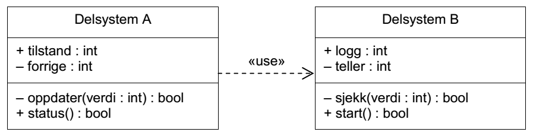


C-programmering
===============
*Teoriøving i TTK4235 Tilpassede datasystemer*


1: Verktøykjeden
----------------

 1. *Fra Eksamen 2012, Oppgave 5c*:
   - Prosessen for å lage et program (fil med kjørbar kode) fra filer med kildekode kan deles i flere trinn med egne verktøy for hvert trinn. Verktøyene assembler, kompilator, lenker og preprosessor inngår i den klassiske verktøykjeden for programmeringsspråket C. Beskriv rekkefølgen verktøyene må kjøres for å gjennomføre hele prosessen, og hvilke verktøy som må kjøres én gang per fil med kildekode.
   - Gjerne tegn en figur. Alle fire verktøyene, kildekodefiler (\*.c), objektfiler (\*.o) og det kjørbare programmet skal være med i figuren.


2: Filer og Moduler
-------------------

 1. Hva er forskjellen mellom deklarasjoner og definisjoner?

 1. Er det noen fundamental forskjell mellom headerfiler (*.h) og c-filer?
 
 1. Hva gjør `static`:
   - På en variabel inni en funksjon
   - På en global variabel (dvs utenfor en funksjon) eller en funksjon

 1. *Fra Eksamen 2012, Oppgave 5b*:

Hvilke mekanismer i programmeringsspråket C er egnet til å implementere den modulasiseringen (oppdelingen), avhengigheten og synligheten som dette klassediagrammet beskriver?

3: Warnings & Errors
--------------------

 1. Hvilket verktøy (preprosessor, kompilator, assembler, lenker) kommer disse feilmeldingene fra, og hva er den mest sannsynlige årsaken til feilmeldingen?
   - `error: 'x' undeclared (first use in this function)`
   - `warning: implicit declaration of function 'foo'`
   - `undefined reference to 'foo'`
   - `fatal error: file.h: No such file or directory`

 1. Hva er en "Segmentation fault"?

4: C-kode
---------

 1. Hva er galt med denne koden?

    ```C
    int sum(int arr[], int size){
        int sum;
        for(int i = 0; i < size; i++){
            sum += arr[i];
        }
        return sum;
    }
    ```

 1. Hva er forskjellen på `hello_1` og `hello_2`, og hvorfor vil en av disse ikke fungere?

    ```C
    int main(void){
        char * hello_1 = "hello";
        hello_1[1] = 'a';
        printf("%s\n", hello_1);
        
        char hello_2[] = "hello";
        hello_2[1] = 'a';
        printf("%s\n", hello_2);
    }
    ```

 1. Hva skriver denne koden ut?

    ```C
    int main(void){
        int a = 42;
        int * p = &a;
        *p = 8;
        printf("a = %d\n", a);
    }
    ```

 1. Hvilken operasjon utfører funksjonen `rotate()`?
    ```C
    #include <stdio.h>

    #define len(a) (sizeof(a)/sizeof(a[0]))

    void printArray(int * arr, int len){
        printf("{");
        if(len != 0){
            printf("%d", arr[0]);
        }
        for(int i = 1; i < len; i++){    
            printf(", %d", arr[i]);
        }
        printf("}\n");
    }


    void swap(int * a, int * b){
        int temp = *a;
        *a = *b;
        *b = temp;
    }

    void rotate(int * first, int * n_first, int * last){
        int * next = n_first;
        while(next != first){
            
            swap(next++, first++);
            
            if(next == last) {
                next = n_first;
            } else if(first == n_first){
                n_first = next;
            }
        }
    }


    int main(){
        int arr[] = {1, 2, 3, 4, 5, 6, 7, 8, 9};
        printArray(arr, len(arr));
        
        rotate(&arr[0], &arr[3], &arr[len(arr)]);
        printArray(arr, len(arr));
        
        rotate(&arr[0], &arr[2], &arr[7]);
        printArray(arr, len(arr));
        
        rotate(&arr[2], &arr[3], &arr[5]);
        printArray(arr, len(arr));    
    }
    ```


 1. Hvorfor kræsjer dette programmet med en "Segmentation fault"?

    ```C
    int main(){
        int * p;
        printf("Value at p: %d\n", *p);
    }
    ```

 1. Hvilke av disse er gyldige?

    ```C
    int * fortytwo(void){
        int a = 42;
        return &a;
    }
    ```
    ```C
    int * fortytwo(void){
        int * a = malloc(sizeof(int));
        *a = 42
        return a;
    }
    ```

